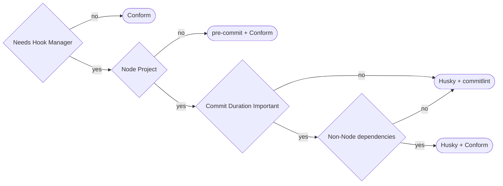

> _Why is this commit message just 'fix stuff'?_

If you've ever muttered these words while reviewing code, you're not alone.
While developers use Git commits daily, many overlook their importance as a
communication tool.

I recently explored ways to make them more meaningful - and discovered some
surprising performance improvements worth sharing.

## Why Care About Commit Formatting?

### The Problem with Unstructured Commits

Consider these two commit histories:

```text
feat: add user authentication system
fix: resolve password reset token expiration
docs: update API authentication examples
```

versus:

```text
updated stuff
fixed the thing
more changes
```

The first history tells a clear story: new authentication features were added, a
bug in password resets was fixed, and documentation was updated. The second
leaves us guessing - which "stuff" was updated? What "thing" was fixed?

### Clear Communication

Well-structured commits serve as documentation, telling the story of your
project's evolution. They help team members (including future you) understand:

- What changed and why
- The scope and impact of changes
- Whether updates might introduce breaking changes
- How features evolved over time

### Practical Benefits

I first realized the importance of structured commits while using
[Neovim](https://github.com/neovim/neovim) with
[lazy.nvim](https://github.com/folke/lazy.nvim) for plugin management. During
updates, I found myself reviewing changelogs regularly. Projects following
conventional commit standards made this process significantly more efficient -
changes were clearly categorized, making it easy to:

- Identify new features
- Spot potential breaking changes
- Understand bug fixes
- Assess update impact

No more getting lost in a sea of random commit messages.

## Understanding Conventional Commits

The
[Conventional Commits specification](https://www.conventionalcommits.org/en/v1.0.0/)
provides a standardized format for commit messages.

The basic structure looks like this: `<type>(scope): message`

For example: `feat(blog): add comment system`

Common `types` include:

- `feat`: New features
  - Example: `feat(ui): add dark mode support`
- `fix`: Bug fixes
  - Example: `fix(api): handle null response from user service`
- `docs`: Documentation changes
  - Example: `docs(readme): clarify installation steps`
- `chore`: Maintenance tasks
  - Example: `chore(deps): update left-pad to 1.30`

The `scope`, while optional, is super helpful for categorizing changes in bigger
projects. For example, a web application might use scopes like `api`, `auth`,
`ui`, or `db`.

This structured format makes it easier to:

- Automatically generate changelogs
- Determine semantic version bumps
- Parse and understand commit history
- Maintain consistency across teams

### Semantic Versioning Made Easy

One of the most compelling reasons to use conventional commits is how they
simplify [semantic versioning](https://semver.org/).

Semantic versioning (`MAJOR`.`MINOR`.`PATCH`) follows these rules:

- `MAJOR` version increments for breaking changes
- `MINOR` version increments for new features
- `PATCH` version increments for bug fixes

With conventional commits, determining version bumps becomes programmatic:

- `feat!:` or `fix!:` commits trigger `MAJOR` version bumps
- `feat:` commits trigger `MINOR` version bumps
- `fix:` commits trigger `PATCH` version bumps

**Example**:

```text
fix(cache): resolve memory leak
-> 1.0.1 (PATCH bump)

feat(search): add fuzzy matching
-> 1.1.0 (MINOR bump)

feat!(auth): switch to OAuth2 only
-> 2.0.0 (MAJOR bump - breaking change)
```

Tools like [release-please](https://github.com/googleapis/release-please) from
Google can automatically:

- Parse your conventional commits
- Generate appropriate version numbers
- Create changelogs
- Generate release notes
- Create release pull requests

This automation eliminates manual version management and reduces human error in
the release process.

## Automating Commit Standards

Rather than relying on self-regulation to follow the Conventional Commits spec
(and trying to remember all the conventions, because who needs that extra mental
load?), we can leverage Git hooks to enforce these standards automatically. Git
hooks are scripts that run at specific points in Git's execution cycle.
[Atlassian has a great explanation](https://www.atlassian.com/git/tutorials/git-hooks)
if you want to dive deeper into how hooks work.

### Tools Overview

There are two key components used to automate commit message standards with
`git` hooks:

1. A `git` hook manager
2. A commit message linter

#### Git Hook Managers

While Git hooks are powerful, managing them directly can be cumbersome:

- Hooks aren't versioned by default
- Hook scripts need manual installation and updates
- Different projects might need different hook configurations
- Hook dependencies need manual management

Hook managers solve these problems by:

- Versioning hooks alongside your code
- Providing declarative configuration
- Automatically managing hook dependencies
- Enabling easy sharing of hook configurations
- Supporting multiple programming languages and tools
- Offering a plugin ecosystem for common tasks

There are two popular options for managing hooks:

- [**pre-commit**](https://pre-commit.com/) - A Python-based framework

  - A simple `pip install pre-commit` is all you need

- [**Husky**](https://typicode.github.io/husky/) - A JavaScript-based framework
  - Installs with `npm install --save-dev husky`

Both options install easily, as `pip` and `npm` are found on most systems; and
it is generally pretty painless to add them if they aren't.

There may be some edge cases for each option, but for general use cases they
seem reasonably equivalents. It's worth noting that I did find `husky` a bit
easier to configure post-install.

#### Commit Linters

For linting commit messages, I explored two options:

- [**commitlint**](https://commitlint.js.org/) - The popular choice, especially
  in `node` land. It's mature and well-documented.

  - Pros:
    - Offers comprehensive rule configuration
    - Has extensive documentation and examples
    - Has prettier output formatting, though this is largely cosmetic
  - Cons:
    - Requires `node` ecosystem
    - Depends on `husky` for hook installation and no `pre-commit` support
    - Provides plugins for various workflows

- [**conform**](https://github.com/siderolabs/conform) - Created by
  [Sidero Labs](https://www.siderolabs.com/), the company behind
  [Talos](https://www.talos.dev/) (of Kubernetes fame), is a Go-based tool that
  offers more features than just commit linting:
  - Pros:
    - Installs as a single binary
    - Fewer dependencies
    - Many useful built-in policies:
      - Conventional Commits
      - GPG signatures
      - License headers
      - Spell checks
  - Cons:
    - Still in alpha release phase
    - The config documentation is lacking

## Performance Benchmarks

I was curious how `conform` would perform against the `commitlint` setup, since
it is written in Go and lacks the dependence on a hook manager.

Performance might not seem that important at first, until you consider that this
is going to run every time you try to make a commit.

Git hooks often get a bad reputation because people load up on hooks and every
commit ends up taking a long time to complete. When making commits frequently,
this gets extremely annoying very quickly.

### Test Setup

While far from a comprehensive test, I setup a quick test for each tool.

1. Create a temporary directory
2. Install the tools
3. Add a basic config
4. Run `hyperfine` (a benchmarking tool) with pass/fail commands
5. Copy the `results.md` to this post.

Since the temporary directory is inside `/tmp/`, which is mounted as a `tmpfs`,
there shouldn't be a concern about storage bottlenecking.

Some more machine details for the curious:

- OS: Fedora 41
- CPU: AMD EPYC 7302 (16 cores - 3GHz)
- RAM: 128GB DDR4-2666

**Test Scripts**:

> :spiral_notepad: **Note**
>
> The proper install method is covered below in [Tool Install](#tool-install) if
> you are curious about install instructions.



```sh
## Set up test repo
tmp_dir=$(mktemp -d /tmp/husky_commitlint.XXX)
cd "$tmp_dir" && git init

## Install tools
npm install --save-dev husky @commitlint/{cli,config-conventional}
### Configure the repo to use Husky
npx husky
### Configure Husky to use commitlint
echo "npx --no -- commitlint --edit \$1" >.husky/commit-msg

## Setup commitlint
cat <<-EOF >.commitlintrc.yaml
extends:
  - "@commitlint/config-conventional"
EOF

## Benchmark fail and pass cases
hyperfine --export-markdown results-fail.md --time-unit millisecond --ignore-failure 'git commit --allow-empty -m "fail"'
hyperfine --export-markdown results-pass.md --time-unit millisecond 'git commit --allow-empty -m "fix: fixed thing"'
```





```sh
## Set up test repo
tmp_dir=$(mktemp -d /tmp/conform.XXX)
cd "$tmp_dir" && git init
### Install commit-msg hooks
cat <<EOF | tee .git/hooks/commit-msg
#!/bin/sh

$tmp_dir/conform-linux-amd64 enforce --commit-msg-file \$1
EOF
chmod +x .git/hooks/commit-msg

## Install tools
### linux-amd64
wget -qO- https://api.github.com/repos/siderolabs/conform/releases |
  jq -r '.[].tag_name' |
  sed -n 1p |
  xargs -I {} wget -qO- https://api.github.com/repos/siderolabs/conform/releases/tags/{} |
  jq '.assets.[] | select(.name == "conform-linux-amd64") | .browser_download_url' |
  xargs -I {} wget -q {} && chmod +x conform-linux-amd64

## Setup conform
cat <<-EOF >.conform.yaml
policies:
  - type: commit
    spec:
      conventional:
        type:
EOF

## Benchmark fail and pass cases
hyperfine --export-markdown results-fail.md --time-unit millisecond --ignore-failure 'git commit --allow-empty -m "fail"'
hyperfine --export-markdown results-pass.md --time-unit millisecond 'git commit --allow-empty -m "fix: fixed thing"'
```



### Results

---

**Husky + commitlint**:

| Command                              |   Mean [ms] | Min [ms] | Max [ms] | Relative |
| :----------------------------------- | ----------: | -------: | -------: | -------: |
| `git commit --allow-empty -m "fail"` | 1422 ± 0.14 |     1400 |     1439 |     1.00 |

| Command                                    |   Mean [ms] | Min [ms] | Max [ms] | Relative |
| :----------------------------------------- | ----------: | -------: | -------: | -------: |
| `git commit --allow-empty -m "fix: thing"` | 2338 ± 0.44 |     2285 |     2414 |     1.00 |

---

**Conform**:

| Command                              |  Mean [ms] | Min [ms] | Max [ms] | Relative |
| :----------------------------------- | ---------: | -------: | -------: | -------: |
| `git commit --allow-empty -m "fail"` | 11.4 ± 0.9 |      8.9 |     14.5 |     1.00 |

| Command                                    |   Mean [ms] | Min [ms] | Max [ms] | Relative |
| :----------------------------------------- | ----------: | -------: | -------: | -------: |
| `git commit --allow-empty -m "fix: thing"` | 969.4 ± 5.7 |    966.4 |    985.5 |     1.00 |

---

:exploding_head: - I was expecting at least some improvement because of the lack
of `husky`, and `conform` being a Go binary.

But a **_100x_** speedup? _nice_.

The reduced speedup during successful commits is from `git` itself. But the 2x
speedup is still pretty significant from a user standpoint. A one second
difference is definitely noticeable.

#### Hook Manager Overhead or Programming Language?

Now my curiosity was piqued. How much of the slowdown was from the `husky` hook
manager overhead and how much was from the fact `conform` is written in Go? I
decided to set up conform using `pre-commit` and `husky` to see what might be
causing the slowdown.

**Conform + pre-commit**:

| Command                              |   Mean [ms] | Min [ms] | Max [ms] | Relative |
| :----------------------------------- | ----------: | -------: | -------: | -------: |
| `git commit --allow-empty -m "fail"` | 357.2 ± 7.3 |    344.6 |    367.0 |     1.00 |

| Command                                    |   Mean [ms] | Min [ms] | Max [ms] | Relative |
| :----------------------------------------- | ----------: | -------: | -------: | -------: |
| `git commit --allow-empty -m "fix: thing"` | 1258 ± 0.19 |     1238 |     1298 |     1.00 |

**Conform + Husky**:

| Command                              |   Mean [ms] | Min [ms] | Max [ms] | Relative |
| :----------------------------------- | ----------: | -------: | -------: | -------: |
| `git commit --allow-empty -m "fail"` | 639.1 ± 3.8 |    631.5 |    644.0 |     1.00 |

| Command                                    |   Mean [ms] | Min [ms] | Max [ms] | Relative |
| :----------------------------------------- | ----------: | -------: | -------: | -------: |
| `git commit --allow-empty -m "fix: thing"` | 1541 ± 0.16 |     1519 |     1570 |     1.00 |

:thinking: Interesting. The hook manager is definitely adding some overhead and
the programming language is certainly a factor.

It might be worth investigating some more hook managers for performance
benefits. Maybe even make one?

### Test Conclusion

The performance differences are striking:

- Conform processes failed commits 100x faster than `husky` + `commitlint`
- Successful commits show a 2x speed improvement with `conform`
- Even when using a hook manager, `conform` outperforms `commitlint`
  significantly

**_Fail_ Tests**:

| Configuration        |  Mean [ms]  | Min [ms] | Max [ms] | Rel-Slowdown |
| :------------------- | :---------: | :------: | :------: | :----------: |
| Conform              | 11.4 ± 0.9  |   8.9    |   14.5   |      0%      |
| pre-commit + Conform | 357.2 ± 7.3 |  344.6   |  367.0   |    -3003%    |
| Husky + Conform      | 639.1 ± 3.8 |  631.5   |  644.0   |    -5506%    |
| Husky + commitlint   | 1422 ± 0.14 |   1400   |   1439   |   -12374%    |

**_Pass_ Tests**:

| Configuration        |  Mean [ms]  | Min [ms] | Max [ms] | Rel-Slowdown |
| :------------------- | :---------: | :------: | :------: | :----------: |
| Conform              | 969.4 ± 5.7 |  966.4   |  985.5   |      0%      |
| pre-commit + Conform | 1258 ± 0.19 |   1238   |   1298   |     -30%     |
| Husky + Conform      | 1541 ± 0.16 |   1519   |   1570   |     -59%     |
| Husky + commitlint   | 2338 ± 0.44 |   2285   |   2414   |    -141%     |

Conform is the clear winner in terms of performance.

Based on the results, my decision tree is:



## Tool Install

While most of these commands will look familiar if you checked out the benchmark
scripts, I wanted to add a more thorough install guide, now that you may have a
better idea of what you might want to use.

### Conform

Unfortunately, since `conform` is marked as a `pre-release`, there isn't a
`latest` tag to grab. Anyone else having flashbacks to [getting the Hugo binary]()?

_No_? Maybe it's just me then :grimacing:

So - we are going to have to do a little extra footwork to download the latest
binary release.

#### Getting the Pseudo-Latest Release

```sh
#!/bin/sh

## set list of releases as variable for reuse
conform_releases=$(wget -qO- https://api.github.com/repos/siderolabs/conform/releases)

## parse the var containing the releases with `jq` for tag names
## should be sorted by latest, so use `sed` print the first line
conform_pseudo_latest_tag=$(echo "$conform_releases" | jq -r '.[].tag_name' | sed -n 1p)

## set the name of our platform
conform_binary_platform="conform-linux-amd64"

## vars need to be exported for them to be available to `jq`
export conform_pseudo_latest_tag conform_binary_platform

## get download url
conform_download_url=$(echo "$conform_releases" | jq -r '.[] | select(.name == env.conform_pseudo_latest_tag) | .assets.[] | select(.name == env.conform_binary_platform) | .browser_download_url')

## download binary and make executable
conform_install_path="$HOME/.local/bin/conform"
wget -O "$conform_install_path" "$conform_download_url" && chmod +x "$conform_install_path"

## cleanup env
unset conform_pseudo_latest_tag conform_binary_platform
```

#### Installing Conform



---

**Get the `conform` binary**:

See [Getting the Pseudo-Latest Release](#getting-the-pseudo-latest-release)
above.

**Create a `conform` config**:

`.conform.yaml`

```yaml
policies:
  - type: commit
    spec:
      conventional:
        descriptionLength: 72
        scopes: [".*"] # Allow all scopes (regex)
        types:
          - build
          - chore
          - ci
          - docs
          - feat
          - fix
          - perf
          - refactor
          - revert
          - style
          - test
      header:
        case: lower
        imperative: true
        invalidLastCharacters: .
        length: 72
      spellcheck:
        locale: US
```

**Add `git` `commit-msg` hook**:

`.git/hooks/commit-msg`

```sh
#!/bin/sh

conform enforce --commit-msg-file "$1"
```

**Make `git` hook executable**:

`chmod +x .git/hooks/commit-msg`

---





---

**Install `pre-commit`**:

`pip install pre-commit`

**Initialize a project**:

`mkdir example-project && cd example-project && git init`

**Create `pre-commit` config**:

`.pre-commit-config.yaml`

```yaml
repos:
  - repo: https://github.com/siderolabs/conform
    rev: main
    hooks:
      - id: conform
        stages:
          - commit-msg
```

**Install the hook with `pre-commit`**:

`pre-commit install --hook-type commit-msg`

**Create `conform` config**:

`.conform.yaml`

```yaml
policies:
  - type: commit
    spec:
      conventional:
        descriptionLength: 72
        scopes: [".*"] # Allow all scopes (regex)
        types:
          - build
          - chore
          - ci
          - docs
          - feat
          - fix
          - perf
          - refactor
          - revert
          - style
          - test
      header:
        case: lower
        imperative: true
        invalidLastCharacters: .
        length: 72
      spellcheck:
        locale: US
```

> :bulb: **Tip**
>
> Once `pre-commit` and `conform` are installed, this script can quickly
> configure a repo

```sh
#!/bin/sh

## Create pre-commit config
cat <<EOF >.pre-commit-config.yaml
# install with `pre-commit install -t commit-msg`
repos:
  - repo: https://github.com/siderolabs/conform
    rev: main
    hooks:
      - id: conform
        stages:
          - commit-msg
EOF

## Install pre-commit hooks
pre-commit install --hook-type commit-msg

## Create conform config
cat <<EOF >.conform.yaml
policies:
  - type: commit
    spec:
      conventional:
        descriptionLength: 72
        scopes: [".*"] # Allow all scopes (regex)
        types:
          - build
          - chore
          - ci
          - docs
          - feat
          - fix
          - perf
          - refactor
          - revert
          - style
          - test
      header:
        case: lower
        imperative: true
        invalidLastCharacters: .
        length: 72
      spellcheck:
        locale: US
EOF
```

---



### Husky and Commitlint

Run the following commands from within a `git` repo.

**`husky`**:

[Link to the official documentation](https://typicode.github.io/husky/get-started.html)

```sh
npm install --save-dev husky

npx husky
```

**`commitlint`**:

[Link to the official documentation](https://commitlint.js.org/guides/getting-started.html)

```sh
npm install --save-dev @commitlint/{cli,config-conventional}

## conventional commits spec
## can use others, such as `config-angular`
## just be sure to replace the package above too
echo "export default { extends: ['@commitlint/config-conventional'] };" > commitlint.config.js
```

**Adding `commitlint` to `husky`**:

```sh
# Add commit message linting to commit-msg hook
echo "npx --no -- commitlint --edit \$1" > .husky/commit-msg
```

## Setting Up Git Hooks Automatically

So - we have our tools installed, but one of the semi-annoying things about Git
hooks is that they need to be set up for each repository. However, we can
**partially** automate this process for new repositories using Git's template
directory feature.

We can automate hook setup for new repositories:

1. Create a template directory with your desired hooks
2. Configure Git to use this template by default for new repositories
3. Every new `git init` will automatically include your hook scripts

> :exclamation: **Important**: Cloning a repo will still require a new install
> of hooks to that repo

> :spiral_notepad: **Note**
>
> It is not possible to have files included in the repo with a template. This
> means no pre-populating a base config for the hooks. A workaround is to add an
> `init.sh` script that is manually executed post init, but this isn't ideal.

### Using a Git Template With Conform

**Create a template directory**:

`mkdir -p ~/git-templates/conform/hooks`

**Download the `conform` binary**:

See: [Conform](#conform) or grab it from
[siderolabs/conform](https://github.com/siderolabs/conform/releases)

Put the binary at `~/git-templates/conform/hooks/conform`

> :spiral_notepad: **Note**
>
> The `commit-msg` script below executes the binary `conform` inside the hooks
> directory, so make sure the binary isn't named something like
> `conform-linux-amd64` from when it was downloaded.
>
> Alternatively, adjust the `commit-msg` file to use a different executable
> name.

**Add your `commit-msg` hook**:

`~/git-templates/conform/hooks/commit-msg`

```sh
#!/bin/sh

.git/hooks/conform enforce --commit-msg-file "$1"
```

**Make the hook executable**:

`chmod +x ~/git-templates/conform/hooks/commit-msg`

**_Optional - make an `init.sh`_**:

`~/git-templates/conform/hooks/init.sh`

```sh
#!/bin/sh

cat <<EOF >.conform.yaml && echo "Added .conform.yaml"
policies:
  - type: commit
    spec:
      conventional:
        descriptionLength: 72
        scopes: [".*"] # Allow all scopes (regex)
        types:
          - build
          - chore
          - ci
          - docs
          - feat
          - fix
          - perf
          - refactor
          - revert
          - style
          - test
      header:
        case: lower
        imperative: true
        invalidLastCharacters: .
        length: 72
      spellcheck:
        locale: US
EOF
```

Make the `init.sh` executable:

`chmod +x ~/git-templates/conform/hooks/init.sh`

**Tell `git` to use this template**:

Option 1 - specify a template for each `git init`:

`git init --template="$HOME/git-templates/conform"`

Option 2 - use a global template:

`git config --global init.templateDir ~/.git-template/conform`

**Add a `conform` config to the repo post-init**:

From inside the new repo `.git/hooks/init.sh` (if added) or manually adding
`.conform.yaml`

## Looking Forward: CI/CD Pipeline Integration

While local commit hooks are valuable, moving some hooks to your CI/CD pipeline
can significantly improve developer experience and enable more comprehensive
checks.

### Moving Beyond Local Validation

An extended local git hook toolset often slows down development by running hooks
far beyond basic commit linting and code formatting. They can quickly become
bloated with hooks for things like tests and builds on every commit.

### Benefits of Pipeline-Based Validation

By offloading these tasks to your CI/CD pipeline, developers can:

- Commit changes quickly without waiting for checks
- Push to feature branches for comprehensive validation
- Faster local development cycles
- Consistent validation environment
- Comprehensive security scanning
- Automated policy enforcement
- Parallel execution of intensive tasks

By moving extended validation to your CI/CD pipeline, developers can focus on
writing code while still ensuring all necessary checks are performed thoroughly
and consistently.

## Conclusion

Structured commits might seem like a small detail, but they significantly impact
project maintenance and team collaboration. The performance improvements offered
by modern tools remove traditional friction points, making it easier than ever
to maintain high commit standards.

Start with small steps - perhaps just categorizing commits as `feat` or `fix`.
As you see the benefits in your workflow, gradually adopt more conventions.
Remember, the goal isn't perfection but better communication and automation in
your development process.
