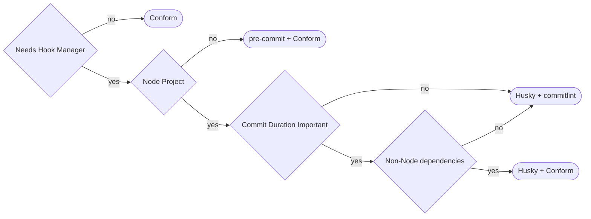

```mermaid
graph TD;
    A-->B;
    A-->C;
    B-->D;
    C-->D;
```

## Test Mermaid Under a Header

```mermaid
graph LR;
  A{Needs Hook Manager}
  A-- no -->1([Conform])
  A-- yes -->B{Node Project}
  B-- no -->2([pre-commit + Conform])
  B-- yes -->D{Commit Duration Important}
  D-- no -->3([Husky + commitlint])
  D-- yes -->F{Non-Node dependencies}
  F-- no -->3
  F-- yes -->4([Husky + Conform])
```

### With Trailing Space?

```mermaid
graph LR;
  A{Needs Hook Manager}
  A-- no -->1([Conform])
  A-- yes -->B{Node Project}
  B-- no -->2([pre-commit + Conform])
  B-- yes -->D{Commit Duration Important}
  D-- no -->3([Husky + commitlint])
  D-- yes -->F{Non-Node dependencies}
  F-- no -->3
  F-- yes -->4([Husky + Conform])

```
